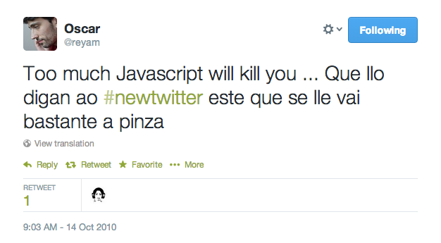
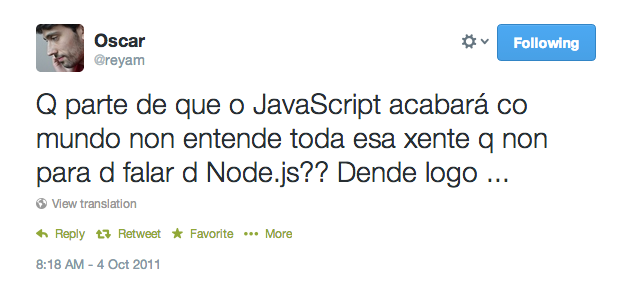
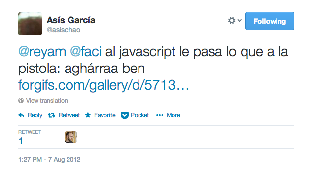
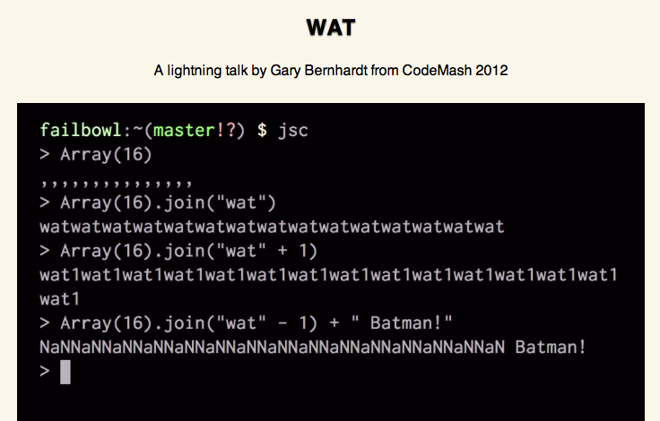
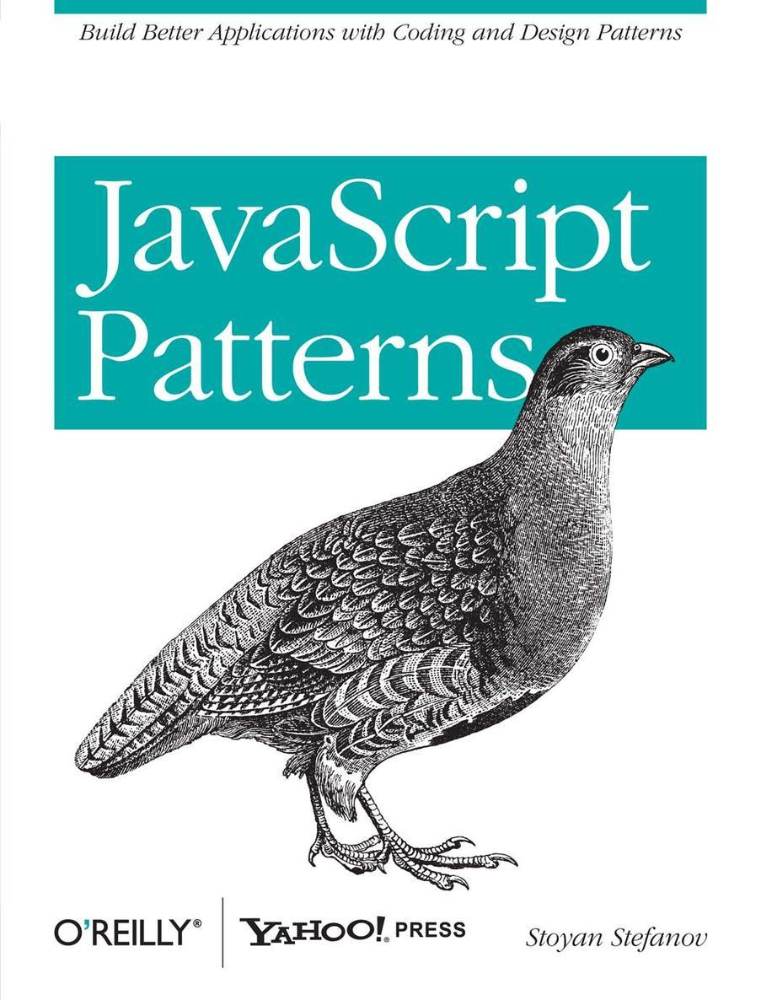
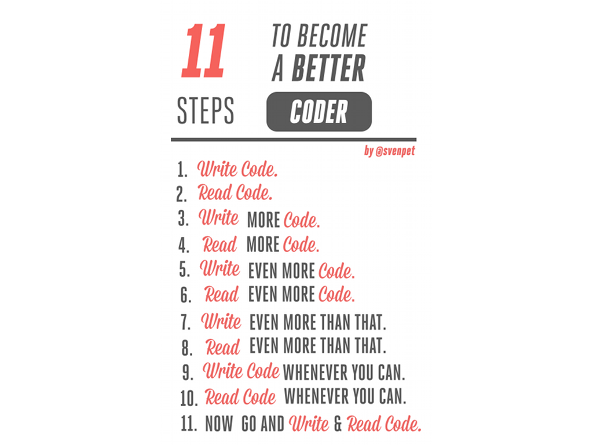

title: El javascript acabará con nosotros
output: index.html
controls: false
progress: false
theme: trabe-theme

-- cover

# El Javascript acabará con nosotros

## http://ir.gl/ejacn

-- image


-- image


<!--
  a qué nos dedicamos, qué hacemos para quién, tecnologías, etc -->


-- image


-- quote

> "El Javascript acabará con nosotros"

<cite>@reyam</cite>

-- image tweet




-- image tweet



-- image tweet


-- image tweet


--

```javascript
var john = {
  name : 'John',

  greet : function() {
    console.log('Hello, I am ' + this.name);
  }
}

john.greet(); // Hello, I am John
```

--

```javascript

var greeter = john.greet;
greeter(); // Hello, I am

var name = 'the window';
greeter(); // Hello, I am the window

var mary = {
  name : 'Mary';
}
greeter.apply(mary); // Hello, I am Mary
```

--

```javascript
button = document.getElementById('my-button');
button.addEventListener('click', john.greet);
// user clicks => Hello, I am undefined
```

-- image tweet


-- image tweet


-- quote

>The problem with JavaScript is not that it is a dynamically typed prototype based object-oriented language without classes. That is actually JavaScript’s strength. The problem is that it is a poorly designed language, filled with many hidden land mines awaiting the unsuspecting developer.

<cite>Jeff Walker - Code Ranger</cite>

-- image tweet



-- image


-- cover

## The world's most misunderstood programming language

http://www.crockford.com/javascript/javascript.html


-- bullets toc bullets-first

## De qué vamos a hablar

* Un poco de historia (nuestra historia)
* Lecciones aprendidas
* Q & A

-- section

## Un poco de historia
### (nuestra historia)


--

## ¿Interné? ¿Eso qué es?

c. 1995

* Netscape 2 &rarr; Javascript
* Creado por Brendan Eich

--

## HTML4 + CSS1

c. 1998-1999

```xml
<TABLE>
  <TR>
    <TD>
    <TD><FONT SIZE=42>Hello welcome to this shit</FONT>
  </TR>
  <TR>
    <TD BGCOLOR=RED>
  </TR>
</TABLE>
```

-- image


-- image


--

## JS: code by Copy-Paste
### Ositos volantes

--

## DHTML
### Browser wars!!!


--

## Batallas
* Soporte del estándar
* Extensiones propietarias
* DOM


-- image


http://www.yuiblog.com/crockford/

--

## The JS Touch
### Librería de animación _mierder_. O algo.

--

### Conclusión personal:
## Pues será verdad,<br>JS apesta

--

## Los años oscuros

c. 2002-2003

* JS: ni en pintura
* Server pages: dinamismo en el lado del servidor


--


## Situaciones tragicómicas

### Viewstate de ASP NET. OMG!

### Algo no encaja


-- image


--

## La luz al final del túnel

c. 2006

### ¡JS cae en manos de gente competente!

-- image


--

## Puntos de inflexión

--

## Prototype

### Rails

* Aislarse de las pescas de los browsers
* Graceful degradation
* Ajax
* Behaviour (componentización)

--

## Primeras tools molonas<br>Firebug
### Después el Chrome y que se quite lo demás

--

## JQuery

c. 2010

* Por los plugins
* Por Rails


--

## JQuery vs Prototype
### wrapping vs extensión


--

## Minimización y transpilers

c. 2011-2012

* Assets pipeline (Rails)
* Minificación
* Coffeescript
* SASS / LESS

--

## JS hype
* Modularización & Gestión dependencias
* Testing
* Patrones
* Evergreen browsers - HTML5 APIs
* NodeJS


--

## Frameworks MV\*
###SPAs
* Routing
* Plantillas en el lado cliente
* Data binding

-- section

## qué sabemos hoy
### o qué creemos que sabemos


--

## JS es malo si le dejas
### ¿puede ser bueno?


-- image full-height


-- image full-height


-- image


http://www.yuiblog.com/crockford/


-- image



https://www.destroyallsoftware.com/talks/wat


--

```javascript
var o = {
  f : function() { //... }
};

o.f();

o['f']();

eval("o.f()"); // DANGER!
```

--

## 'use strict'

<br>

```javascript
"use strict";
mistypedVaraible = 17; // ReferenceError
```

--

## JS no es Java
* Sintaxis
* Patrones
* Convenciones

--

## Closures & IIF

--

```javascript

var three = 3;

var triple = function(x) {
  return x * three;
}

triple(5) // 15

three = 4;

triple(5) // 20

```


--

```javascript

var three = 3;

var triple = (function() {
  var three = 3;

  return function(x) {
    return x * three;
  }
})();

triple(5) // 15

three = 4;

triple(5) // 15

```

--

```javascript

undefined = 3; //WTF!
$ = {};

(function($, window, undefined) {
  // $ is JQuery, window the window
  // and undefined is still undefined
})(jQuery, window);

```

--

## Module pattern

--

```javascript
var door = {
  closed : true,

  isClosed : function() {
    return this.closed;
  },

  //...
}

door.isClosed(); // true
door.closed = 'p0wned!';
door.isClosed(); // p0wned!

// Truth-y and False-y madness
door.isClosed() ? 'notSoP0wned' : 'p0wnedIndeed'; // notSoP0wned
```

--

```javascript
var door = (function() {
  var closed = true;

  var isClosed = function() {
    return closed;
  }

  return {
    isClosed : isClosed;
  }
})();

door.isClosed(); // true
door.closed = 'p0wned!';
door.isClosed(); // true. FTW
```

-- image full-height



--

## Todo es falso
### Salvo alguna cosa


http://javascriptweblog.wordpress.com/2011/02/07/truth-equality-and-javascript/

[&nbsp;](images/rajoy.webp)

--

## No es lo mismo
### Es distinto

* `==` vs `===`
* http://dorey.github.io/JavaScript-Equality-Table/
--

## JS **es** OO con prototipos
### JS **no es** OO con clases

--

```javascript
function Dog(name) {
  this.name = name;
}


Dog.prototype.greet = function() {
  console.log("Hello, I'm " + this.name);
}

var lassie = new Dog('Lassie');
var trosky = new Dog('Trosky');

lassie.greet(); // Hello, I'm Lassie
trosky.greet(); // Hello, I'm Trosky
```

--


--

```javascript
console.log(lassie.prototype) // undefined
console.log(lassie.__proto__) // Dog { greet: function }

Dog.prototype === lassie.__proto__ // true
```

--

```javascript
lassie.run(); // ERROR!

Dog.prototype.run = function() {
  console.log('Running like a dog');
};

lassie.run(); // Running like a dog

trosky.run = function() {
  console.log('Trosky running');
}

trosky.run(); // Trosky running
```

--

```coffeescript
class Dog
  constructor : (@name) ->

  greet : -> console.log "Hello, I'm #{@name}"

new Dog('Lassie').greet() # Hello, I'm Lassie
new Dog('Trosky').greet() # Hello, I'm Trosky
```

<!-- evidenciar petote de JS generado -->

--

## JS no es el DOM
<br>

```javascript
$('body').on('click', '[data-behaviour=clear-input]', function(e) {
  var $el;
  e.preventDefault();
  $el = $(e.currentTarget);
  return $el.siblings('input').val('');
});
```

--

## JS no es JQuery
<br>

```javascript
var heading = document.createElement("h1");
var headingText = document.createTextNode("Big Head!");

heading.appendChild(headingText);
document.body.appendChild(heading);
```

--

## Santa trinidad<br>HTML + CSS + JS
### Estructura, estilos, comportamiento
<br>

```javascript
$('.notice').css({ 'color': 'red' }); // NOP

$('.notice').addClass('alert'); // YEP

```

--
## Para algunas cosas se necesitan librerías

* JQuery
* Underscore
* Zepto

--

## Llamadas AJAX
<br>

```javascript
$.get('http://api.com/davidbarral', function(result) { ... });
```

--

## Callbacks vs promesas
### Spaghetti vs lasagna

--

```javascript

$.get('http://api.com/davidbarral', function() {
  $.get('http://api.com/asischao', function() {
    $.get('http://api.com/trabe', function() {
      console.log('All together right now!');
    }
  }
});

```

--

```javascript

var done = 0;

function callback() {
  done += 1;

  if (done === 3) {
    console.log('All together right now!');
  }
};

$.get('http://api.com/davidbarral', callback);
$.get('http://api.com/asischao', callback);
$.get('http://api.com/trabe', callback);
```

--

```javascript
var davidbarral = $.get('http://api.com/davidbarral');
var asischao = $.get('http://api.com/asischao');
var trabe = $.get('http://api.com/trabe');

$.when(davidbarral, asischao, trabe).done(function() {
  console.log('Maaaambo!')
});
```

--

```javascript
function myThing() {
  var deferred = $.Deferred()

  // ...
  // resolve the deferred
  // ...

  return deferred.promise();
}

myThing().done(function() {
  console.log('Done!');
})
```

--

## Para algunas cosas **no** se necesitan librerías

--

## Una aplicación JS es una aplicación
### Tauto
* Patrones
* Peculiaridades (entorno de ejecución, rendimiento, etc.)

<!-- JS no es el DOM. Rendimiento suele. -->

--

## El MVC JS

* Modelo: objetos JS
* Vista: plantillas JS (funciones) o trozos del DOM
* Controlador: gestión de eventos
* Separar JS de CSS (attributos DATA)
* Proxificar eventos, bus eventos (microevents, $({})) <!-- transpa de rich hickey, independizar con cola de mensajes. -->

http://jsbin.com/cirijehi/1/edit

--

## Usar un framework MV*
* Estructura
* Utilidades: data-binding, routing, estado, persistencia, etc.

--

## Tests
* Headless testing
* Desacoplar el DOM: very very hard!

--

```javascript

describe('doubler', function() {
    it('doubles a number', function() {
      expect(doubler(5)).toEqual(10);
    });
});

function doubler(x) {
  return 2 * x;
}

```

--
## Let go and move on
### Si es posible, usa sólo navegadores modernos

* http://caniuse.com

-- section

## Conclusiones

-- quote

Atwood's Law:

Any application that can be written in JavaScript,
will eventually be written in JavaScript

http://blog.codinghorror.com/the-principle-of-least-power/


--

## Por ejemplo, esta presentación se genera con JS

* http://github.com/jdan/cleaver

--

## Léete estos libros

* Javascript: the good parts - D. Crockford
* Javascript patterns - S. Stefanov

--

## Usa buena documentación

* https://developer.mozilla.org/en-US/
* http://stackoverflow.com ;)

--

## Aprende a usar esta herramienta

* Chrome dev tools

<!--
Ejemplos de, console.log, debugger, resources, network flush, breakpoints (break on node changes, xhr breakpoints), Device emulation, Audits
http://berzniz.com/post/78260747646/5-javascript-debugging-tips-youll-start-using-today -->

--

## Búscate un framework de testing

* Jasmine
* Mocha
* QUnit

--
## Elige la solución apropiada

* Chambas JS + Ajax
* RJS
* Single Page Apps

-- image



--
## People to follow

* Crockford +DouglasCrockfordEsq
* Stefanov @stoyanstefanov
* Addy Osmani @addyosmani
* David Walsh @davidwalshblog
* Paul Irish @paul\_irish
* Ilya Grigorik @igrigorik
* Steve Souders @souders

--

## El futuro: ECMAScript 6

* Traceur Compiler: JSNext &rarr; ECMASCript 5
* https://github.com/google/traceur-compiler

--

# ¡Eso es todo amigos!
## ¿Preguntas?
